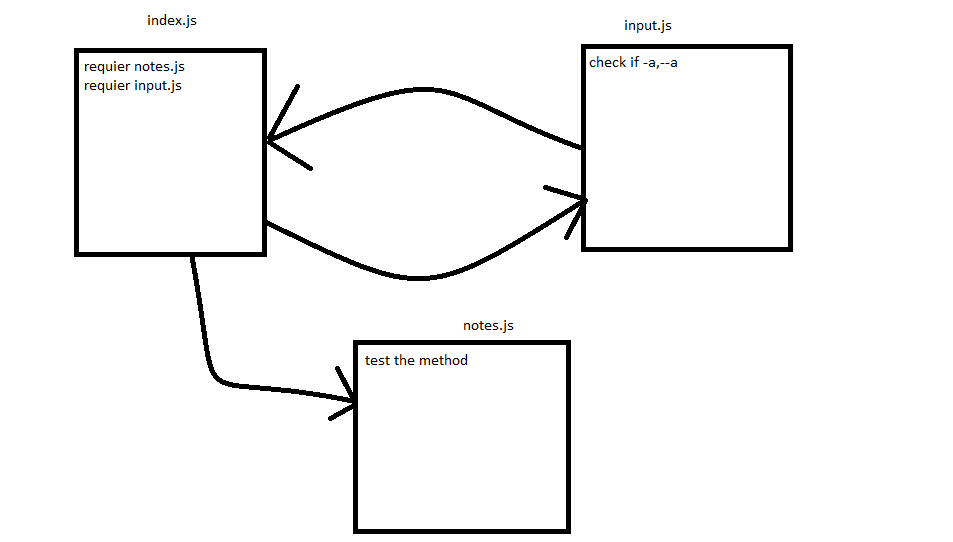

# LAB - Class 01

## Project: Notes

### Author: Yazan Aljamal

### Links and Resources

- [submission PR](https://github.com/yaljamal-401-advanced-javascript/notes/pull/19)

### Modules
#### `input.js`
### `notes.js`

### Setup

#### How to initialize/run your application 

- `node index.js -a 'msg'`

#### How to use your library 
#### Tests
- Lint test: `npm run lint`
- npm test: `npm test`

#### UML

